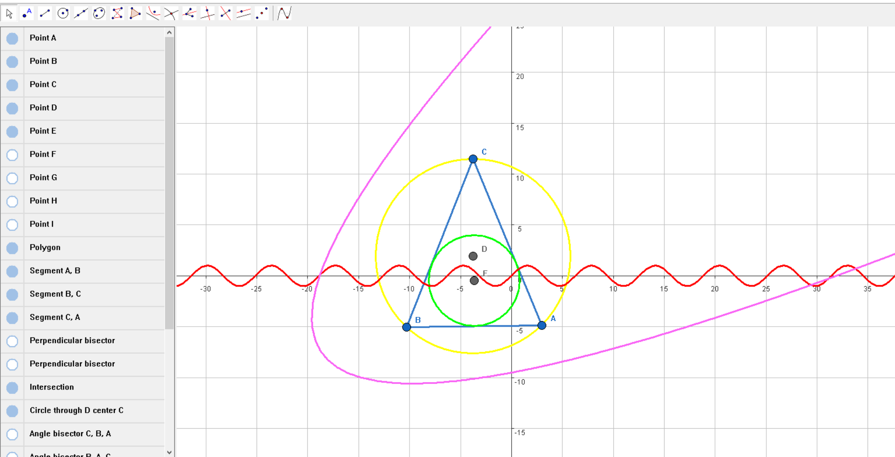
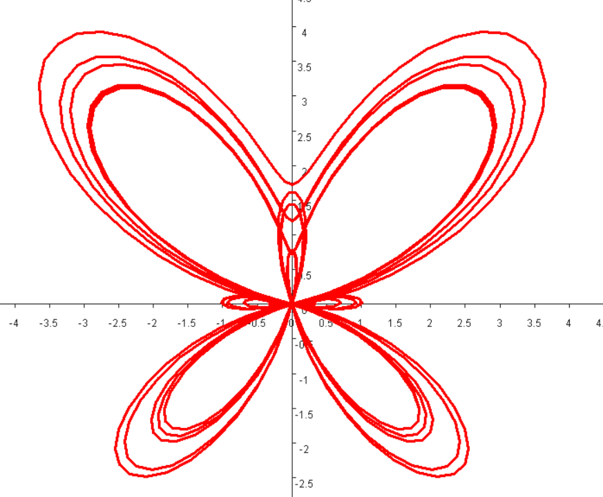
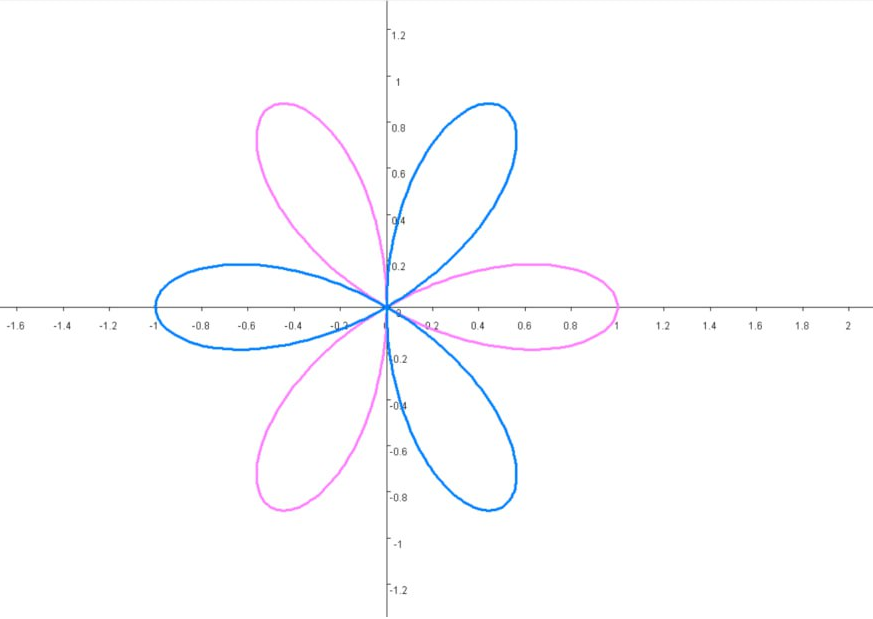
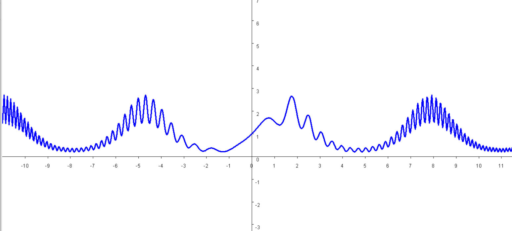

# BleenGeometry
Продолжение и развитие проекта с [Mini Bleenchiki](https://github.com/theexponenta/dos-plotter)\
\
BleenGeometry - программа для создания динамических геометрических построений и графиков математических функций, сделанная по подобию [GeoGebra](https://geogebra.org/geometry) и [Desmos](https://www.desmos.com/calculator), написанная полностью на ассемблере FASM. Для вывода графики используется стандартный Windows GDI, никакие сторонние графические библиотеки не используются.

### Инструменты
- Перемещение
- Точка
- Прямая
- Отрезок
- Окржность
- Эллипс
- Ломаная
- Многоугольник
- Парабола
- Точка пересечения
- Биссектриса
- Перпендикуляр
- Серединный перпендикуляр
- Параллельная прямая
- Середина отрезка
- График функции

### Функции
- Включение/отключение осей и сетки
- Включение/отключение привязки точек к узлам сетки
- Масштабирование рабочей области
- Массовое удаление и перемещение объектов
- Отмена действий
- Сохранение в файл
- Скрытие объектов
- Изменение объектов: толщина линии, цвет, имя

#### Графики
Доступно 2 типа графиков функций:
- Обычный. Графики вида $y=f(x)$
- Параметрический. График, заданный системой уравнений
$x = x(t), y = y(t)$

|   |  |
| ------------- | ------------- |
|   |   |

